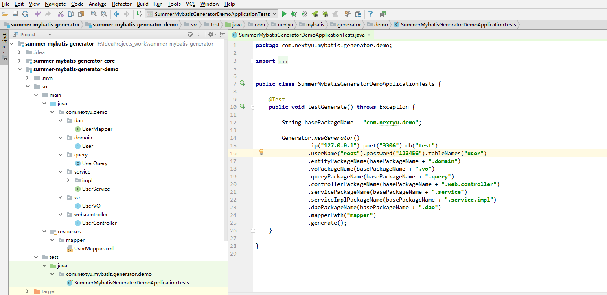

# 基于 mybatis generator 的代码生成器

目前仅支持 MySQL

## 指定一个或多个表名，可以生成对应的如下文件（默认会覆盖以前的文件）

- Entity
- VO
- Query
- Controller (包含部分常用方法)
- Service (包含部分常用方法)
- ServiceImpl (包含部分常用方法)
- Mapper
- Mapper.xml

## 使用方法

1. 打开 summer-mybatis-generator-demo
2. 运行 `SummerMybatisGeneratorDemoApplicationTests.testGenerate()` 方法

## 运行效果图

